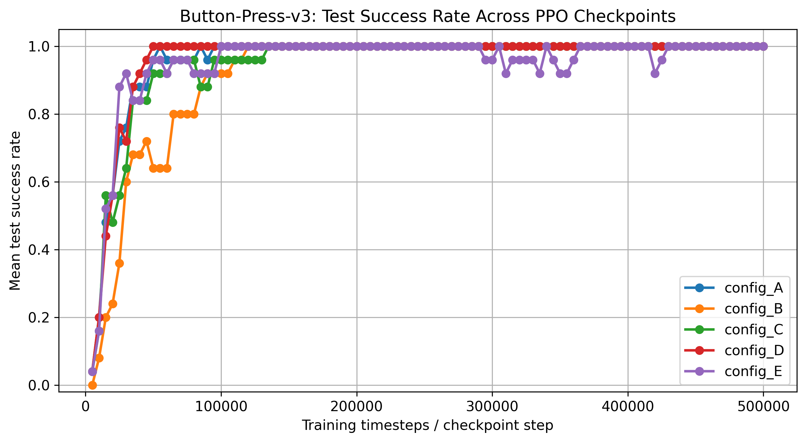
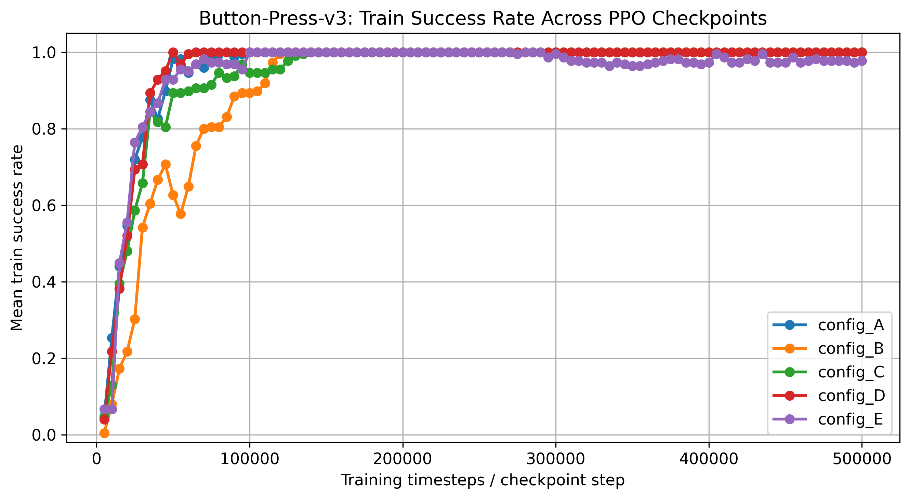
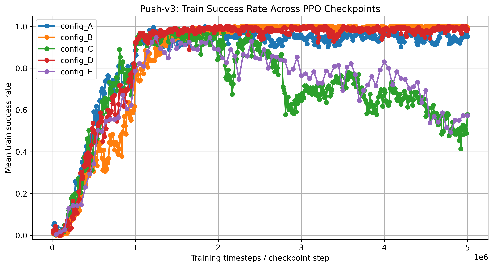
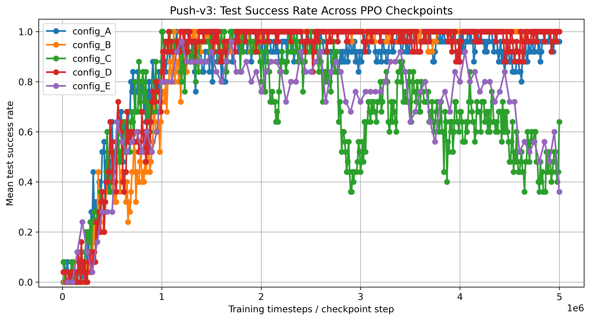
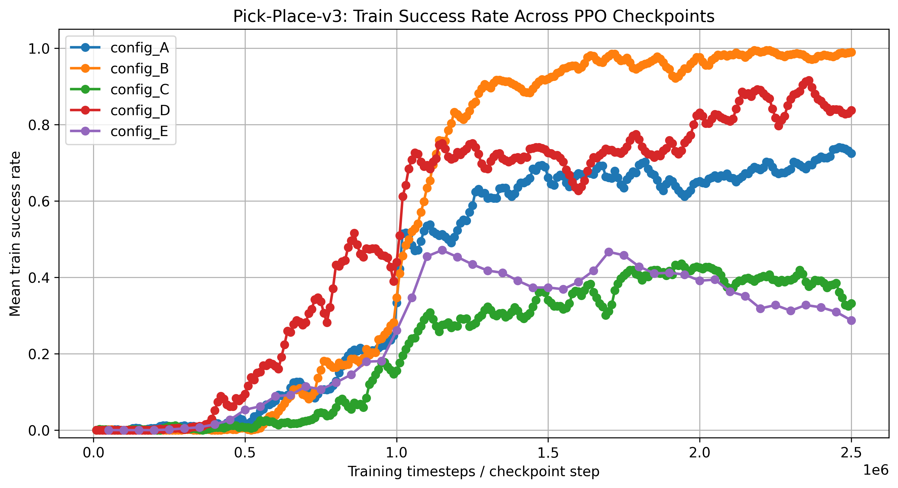
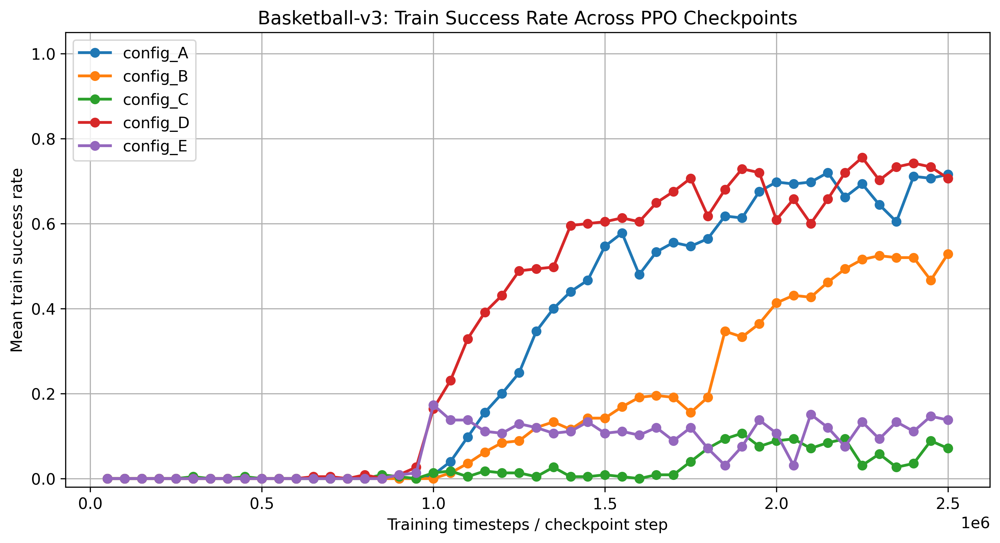

# Πειράματα με PPO σε single-task περιβάλλοντα του Metaworld

Παρακάτω παρουσιάζονται τα αποτελέσματα και οι επιδόσεις του αλγορίθμου Proximal Policy Optimization (PPO), ο οποίος χρησιμοποιήθηκε για την εκπαίδευση πρακτόρων σε τέσσερα διαφορετικά single-task περιβάλλοντα του Meta-World.

## Περιβάλλοντα

- **button-press** - Πάτημα ενός κουμπιού
- **push** - Σπρώξιμο ενός αντικειμένου σε συγκεκριμένο σημείο (στόχο)
- **basketball** - Τοποθέτηση μιας μπάλας σε καλάθι
- **pick-place** - Πιάσιμο ενός αντικειμένου και μεταφορά του σε ένα συγκεκριμένο σημείο xyz

## Setup
Για κάθε single-task περιβάλλον χρησιμοποιήσαμε το benchmark MT1 της βιβλιοθήκης Metaworld, το οποίο προσφέρει 50 διαφορετικά goal η/και object position variations σε σχέση με την θέση τους για κάθε περιβάλλον. Από αυτά τα 50 κάθε φορά χρησιμοποιήθηκαν 5 non-overlaping train/test splits με 45 train variations και 5 test variations, για να εκτιμηθεί όσο το δυνατόν καλύτερα η ικανότητα γενικοποίησης του αλγορίθμου PPO.

### SubProcVecEnv
Για την εκπαίδευση των πρακτόρων χρησιμοποιήθηκε και η βιβλιοθήκη SubProcVec η οποία δημιουργεί πολλαπλά instances του ίδιου περιβάλλοντος που τρέχουν παράλληλα κατά την διάρκεια της εκπαίδευσης.
Ο agent δηλαδή μαζεύει trajectories και από τα 4 περιβάλοντα ταυτόχρονα.Αυτό βοηθά στην γρηγορότερη επαίδευση του πράκτορα και κάνει πιο σταθερή την εκπαίδευση.
Για παράδειγμα όταν ένα config έχει
```python
n_steps = 1024
n_envs = 4
```
τότε κάθε PPO update βασίζεται σε 
``` python
1024 x 4 = 4096 transitions
```

### VecNormalize
Χρησιμοποιούμε επίσης και την βιβλιοθήκη VecNormalize της StableBaselines η οποία κανονικοποιεί τα observations και τα rewards κατά την διάρκεια της εκπαίδευσης. Αυτό χρησιμοποιείται γιατί στα περιβάλλοντα του MetaWorld τα observations μπορεί να περιλαμβάνουν τιμές με διαφορετικές κλίμακες.
Κατα την αξιολόγηση, τα στατιστικά του VecNormalize φορτώνονται ξανά και παγώνουν έτσι ώστε να μην αλλάζουν κατά την διάρκεια του evaluation. Έτσι το μοντέλο αξιολογείται με τα ίδια normalization statistics που χρησιμοποιήθηκαν κατά την εκπαίδευση.

## PPO Configurations
Χρησιμοποιήθηκαν 5 PPO Configurations με το εξής σκεπτικό

| Config | Λογική |
|---|---|
|config_A|Βασική εκδοχή του PPO που χρησιμοποιείται ως σημείο αναφοράς για τη σύγκριση των υπόλοιπων configurations.|
|config_B|Πιο συντηρητική εκδοχή με μικρότερο learning rate, μεγαλύτερο batch size, περισσότερα epochs και μικρότερο clip range, με στόχο πιο σταθερές ενημερώσεις της πολιτικής.|
|config_C|Χρησιμοποιεί μικρότερο n_steps, άρα μικρότερο rollout size και πιο συχνά updates. Εξετάζει αν οι συχνότερες ενημερώσεις βοηθούν ή αποσταθεροποιούν τη μάθηση.|
|config_D|Προσθέτει μικρό entropy coefficient ώστε το policy να έχει περισσότερη εξερεύνηση κατά την εκπαίδευση.|
|config_E|Παραλλαγή πιο κοντά στο learning rate που αναφέρεται στο Meta-World paper, με learning_rate = 5e-4. Χρησιμοποιείται για να εξεταστεί αν πιο επιθετικές ενημερώσεις βελτιώνουν την ταχύτητα μάθησης ή προκαλούν αστάθεια.|
### Hyperparameters
| Hyperparameter | `config_A` | `config_B` | `config_C` | `config_D` | `config_E` |
|---|---:|---:|---:|---:|---:|
| `learning_rate` | `3e-4` | `1e-4` | `3e-4` | `2.5e-4` | `5e-4` |
| `n_steps` | `1024` | `1024` | `512` | `1024` | `1024` |
| `batch_size` | `256` | `512` | `256` | `256` | `256` |
| `n_epochs` | `10` | `15` | `10` | `10` | `10` |
| `gamma` | `0.99` | `0.995` | `0.99` | `0.99` | `0.99` |
| `gae_lambda` | `0.95` | `0.95` | `0.95` | `0.95` | `0.95` |
| `clip_range` | `0.20` | `0.15` | `0.20` | `0.20` | `0.20` |
| `ent_coef` | `0.0` | `0.0` | `0.0` | `0.002` | `0.0` |
| `vf_coef` | `0.5` | `0.7` | `0.5` | `0.5` | `0.5` |
| `max_grad_norm` | `0.5` | `0.5` | `0.5` | `0.5` | `0.5` |

### Default παραμέτροι του PPO που δεν έχουν αλλαχθεί
| PPO parameter | SB3 default value |  Σύντομη περιγραφή |
|---|-----|---|
| `clip_range_vf` | `None`  | Δεν εφαρμόζεται ξεχωριστό clipping στο value function. |
| `normalize_advantage` | `True`  | Τα advantage estimates κανονικοποιούνται πριν από το PPO update. |
| `use_sde` | `False` | Δεν χρησιμοποιείται generalized State Dependent Exploration. |
| `sde_sample_freq` | `-1`  | Συχνότητα ανανέωσης του gSDE noise. Δεν έχει πρακτική επίδραση αφού `use_sde=False`. |
| `rollout_buffer_class` | `None`  | Χρησιμοποιείται το default rollout buffer του SB3. |
| `rollout_buffer_kwargs` | `None` | Δεν δίνονται επιπλέον arguments στο rollout buffer. |
| `target_kl` | `None`  | Δεν υπάρχει early stopping με βάση KL divergence. |
| `stats_window_size` | `100`  | Τα training logs υπολογίζονται ως μέσος όρος σε παράθυρο 100 episodes. |
| `policy_kwargs` | `None`  | Χρησιμοποιείται η default αρχιτεκτονική του `MlpPolicy`. |
| `_init_setup_model` | `True`  | Το μοντέλο αρχικοποιείται κανονικά κατά τη δημιουργία του PPO object. |

### Η default αρχιτεκτονική του MlpPolicy είναι :
```python
net_arch = dict(
    pi=[64, 64],
    vf=[64, 64],
)
```
Δηλαδή
| Branch | Ρόλος                  | Default hidden layers |
| ------ | ---------------------- | --------------------- |
| `pi`   | Actor / policy network | `[64, 64]` + tanh           |
| `vf`   | Critic / value network | `[64, 64]` + tanh           |

### rollout_buffer ανα config :
| Config | `n_steps` | `n_envs` | Rollout buffer size (`n_steps × n_envs`) | `batch_size` | Mini-batches ανά epoch | `n_epochs` | PPO mini-batch updates ανά rollout |
|---|---|---|---|---|---|---|---|
| `config_A` | `1024` | `4` | `4096 transitions` | `256` | `4096 / 256 = 16` | `10` | `16 × 10 = 160` |
| `config_B` | `1024` | `4` | `4096 transitions` | `512` | `4096 / 512 = 8` | `15` | `8 × 15 = 120` |
| `config_C` | `512` | `4` | `2048 transitions` | `256` | `2048 / 256 = 8` | `10` | `8 × 10 = 80` |
| `config_D` | `1024` | `4` | `4096 transitions` | `256` | `4096 / 256 = 16` | `10` | `16 × 10 = 160` |
| `config_E` | `1024` | `4` | `4096 transitions` | `256` | `4096 / 256 = 16` | `10` | `16 × 10 = 160` |

### Checkpoints
Κατά την διάρκεια της εκπαίδευσης αποθηκεύονται checkpoints σε τακτά χρονικά διαστήματα.Αυτό επιτρέπει την ανάλυση της πορείας την μάθησης του πράκτορα εκτός της τελικής του απόδοσης.Με αυτό τον τρόπο καταλαβαίνουμε:

- σε ποιο σημείο της εκπαίδευσης ο agent αρχίζει να μαθαίνει το task
- αν η απόδοση συνεχίζει να βελτιώνεται ή σταθεροποιείται
αν κάποια configurations μαθαίνουν πιο γρήγορα από άλλα

### Evaluation
H αξιολόγηση γίνεται ξεχωριστά για τα training και test variations κάθε slit

Τα βασικά metrics που καταγράφονται είναι:

| Metric | Περιγραφή |
| ------------------------ | ---------------------------------------------------------- |
| `success_rate` | Ποσοστό επιτυχημένων episodes                              |
| `avg_return` | Μέσο συνολικό reward ανά episode  |
| `avg_steps` | Μέσο μήκος episode                                         |
| `avg_first_success_step` | Μέσο timestep στο οποίο επιτεύχθηκε για πρώτη φορά success |
| `episodes` | Πλήθος episodes που αξιολογήθηκαν                          |

Το βασικό metric που χρησιμοπιείται για την σύγκριση των μοντέλων είναι το succes rate. Το avg_return καταγράφεται επίσης αλλά θεωρείται δευτερεύον metric καθώς το μοντέλο μπορεί να συγκεντρώνει reward χωρίς να πετυχαίνει το task.

## Results

### Button-Press-v3

Το `button-press-v3` είναι το πιο απλό single-task περιβάλλον από τα τέσσερα που εξετάστηκαν. Ο στόχος του πράκτορα είναι να ελέγξει τον robotic arm ώστε να πατήσει ένα κουμπί. Για αυτόν τον λόγο, το συγκεκριμένο περιβάλλον λειτουργεί και ως βασικό sanity check για το training και evaluation pipeline του PPO.

Τα αποτελέσματα δείχνουν ότι το `button-press-v3` μπορεί να λυθεί αξιόπιστα από διαφορετικές PPO παραμετροποιήσεις. Επομένως, οι διαφορές μεταξύ των configurations δεν είναι τόσο έντονες όσο σε δυσκολότερα περιβάλλοντα.

#### Test Success Rate Across Checkpoints

Η checkpoint-based αξιολόγηση δείχνει ότι όλα τα configurations μαθαίνουν το task σχετικά γρήγορα. Τα περισσότερα configurations φτάνουν σε πολύ υψηλό ή τέλειο test success rate αρκετά νωρίς κατά τη διάρκεια της εκπαίδευσης.



Η καμπύλη του test success rate δείχνει ότι το task λύνεται πριν από το τελικό checkpoint. Αυτό είναι σημαντικό, γιατί δείχνει ότι η τελική απόδοση δεν είναι πάντα αρκετή για να περιγράψει πλήρως τη συμπεριφορά του μοντέλου. Για παράδειγμα, κάποιο configuration μπορεί να φτάσει σε τέλεια απόδοση νωρίτερα και να παρουσιάσει μικρή πτώση στο final checkpoint.

#### Train Success Rate Across Checkpoint


### Push

#### Train set Learning Curve



### Test Set Learning Curve



### Pick Place

#### Train set Learning Curve



### Test Set Learning Curve


### Basketball

#### Train set Learning Curve



### Test Set Learning Curve


